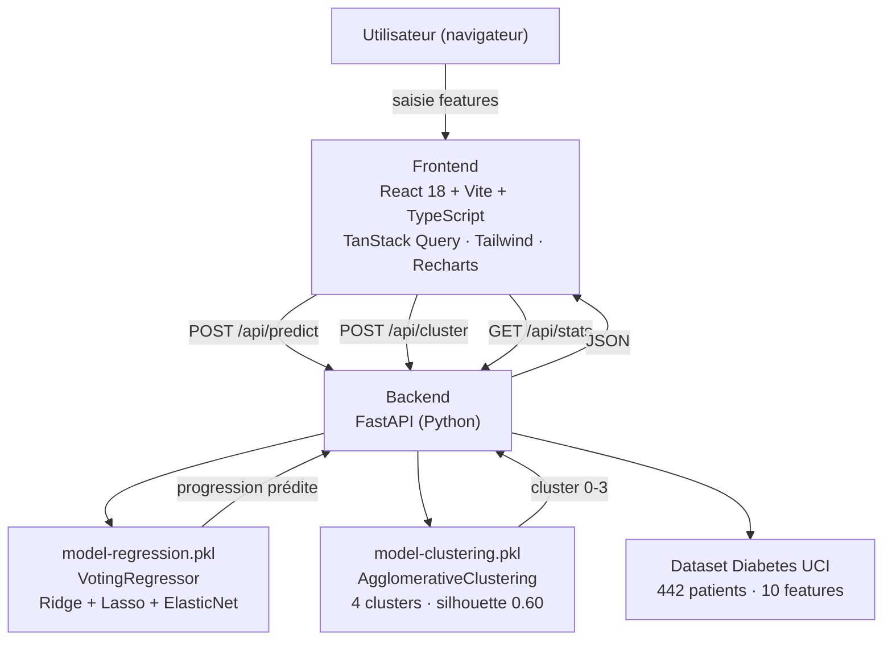

# Dashboard Diabète — Prédiction & Clustering

> **Question prédictive :** À partir des caractéristiques biologiques d'un patient au moment du diagnostic (IMC, pression artérielle, taux de cholestérol...), peut-on prédire la progression de son diabète un an plus tard ?

Application full-stack déployée sur Hugging Face Spaces — B3 Data & IA, Sup de Vinci Nantes.

[](https://github.com/[org]/[repo]/actions/workflows/deploy.yml)

---

## Architecture



---

## Dataset

**sklearn `load_diabetes`** — 442 patients, 10 features biologiques normalisées (entre -0.2 et +0.2), cible continue (progression du diabète à 1 an, valeurs 25–346).

| Feature | Description |
|---------|-------------|
| `age` | Âge du patient |
| `sex` | Sexe (encodé numériquement) |
| `bmi` | Body Mass Index (poids / taille²) |
| `bp` | Pression artérielle moyenne |
| `s1` | Taux de cholestérol total |
| `s2` | LDL — « mauvais cholestérol » |
| `s3` | HDL — « bon cholestérol » |
| `s4` | Ratio cholestérol total / HDL |
| `s5` | Log du taux de triglycérides |
| `s6` | Glycémie (taux de sucre sanguin) |

---

## Modèles

### Régression — prédire la progression

- **Modèle :** `VotingRegressor` (Ridge α=10 + Lasso α=0.1 + ElasticNet α=0.1)
- **Métrique :** R² = **0.5232** (52 % de la variance expliquée)
- **Split :** 60 / 20 / 20 — `random_state=42` → reproductible
- **Export :** `backend/model-regression.pkl`

### Clustering — segmenter les profils patients

- **Modèle :** `AgglomerativeClustering` — features `sex` + `bmi` — 4 clusters
- **Métrique :** silhouette = **0.6015** (sélectionné automatiquement parmi KMeans + Agglomerative sur toutes les paires de features)
- **Distribution :** cluster 0 → 170 · cluster 1 → 85 · cluster 2 → 150 · cluster 3 → 37
- **Export :** `backend/model-clustering.pkl`

---

## Démarrer en local

### Backend (terminal 1)

```bash
cd backend
python -m venv .venv
# Windows
.venv\Scripts\activate
# Mac / Linux
source .venv/bin/activate

pip install -r requirements.txt

# Générer les modèles si absents (exécuter les notebooks une fois)
# Les .pkl doivent être dans backend/

python main.py   # API sur http://localhost:8000
```

Vérification : [`http://localhost:8000/api/health`](http://localhost:8000/api/health)

### Frontend (terminal 2)

```bash
cd frontend
npm install
npm run dev      # app sur http://localhost:5173
```

---

## Endpoints API

| Méthode | Route | Description |
|---------|-------|-------------|
| `GET` | `/api/health` | État des modèles chargés |
| `POST` | `/api/predict` | Prédit la progression (régression) |
| `POST` | `/api/cluster` | Retourne le cluster du patient |
| `GET` | `/api/stats` | Progression moyenne par tranche de BMI |
| `GET` | `/api/cluster-data` | Nuage de points BMI/s5 coloré par cluster |

**Corps de `/api/predict` et `/api/cluster` :**

```json
{
  "age": 0.038, "sex": 0.051, "bmi": 0.062, "bp": 0.022,
  "s1": -0.044, "s2": -0.035, "s3": -0.043,
  "s4": -0.003, "s5": 0.020, "s6": -0.018
}
```

---

## Déploiement

L'application est déployée sur **Hugging Face Spaces** (0 €/mois, free tier).

```bash
# Build du frontend
cd frontend && npm run build

# Le bloc StaticFiles dans backend/main.py sert le dist/ en production
```

Le déploiement est automatisé via **GitHub Actions** (`.github/workflows/deploy.yml`) :
- `git push` sur `main` → build Docker → deploy → health check automatique

---

## Stack

| Couche | Technologie |
|--------|------------|
| Frontend | React 18 + Vite + TypeScript |
| Data fetching | TanStack React Query |
| Styles | Tailwind CSS + `cn()` (shadcn-ready) |
| Graphes | Recharts (`ResponsiveContainer`) |
| Icônes | lucide-react |
| Backend | FastAPI + Uvicorn |
| ML | scikit-learn + joblib |
| CI/CD | GitHub Actions |
| Hébergement | Hugging Face Spaces |

---

## Limites connues

- Dataset de 442 observations → R² limité à 0.52 ; un dataset plus grand améliorerait les prédictions
- Données issues des années 1990, patients américains uniquement
- Pas de cross-validation (manque de temps) — les métriques sont à interpréter avec précaution
- Pas de gestion des entrées aberrantes côté API (ex : `bmi=99`)
